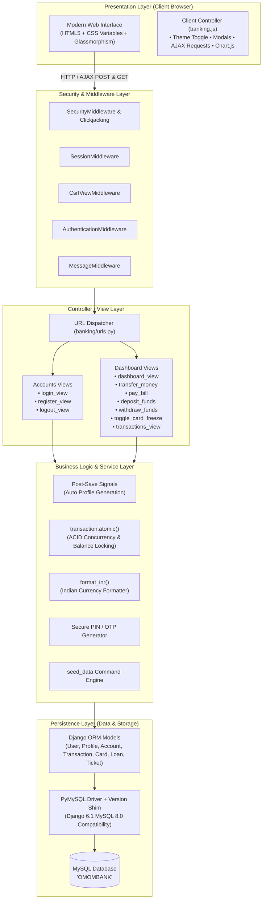
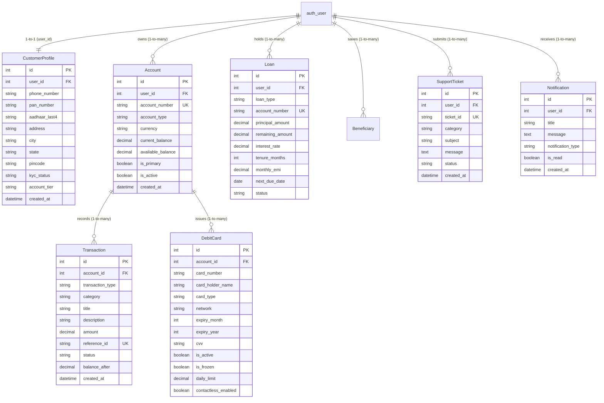
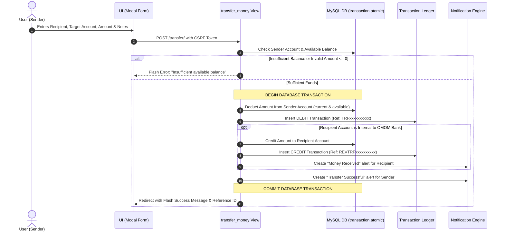

# 🏦 OMOM Bank — Modern Enterprise Digital Banking System

[](https://www.djangoproject.com/)
[](https://www.python.org/)
[](https://www.mysql.com/)
[](#frontend--design-system)
[](#license)

> **OMOM Bank** is a full-stack, secure, high-performance digital banking web application. It combines robust banking business logic (ACID-compliant atomic fund transfers, virtual card management, bill payments, and loan tracking) with a responsive, glassmorphic FinTech user interface equipped with dynamic dark/light themes and real-time financial charts.

---

## 📑 Table of Contents

- [1. Executive Summary](#1-executive-summary)
- [2. Key Features](#2-key-features)
- [3. System Architecture](#3-system-architecture)
  - [3.1 High-Level Architecture Diagram](#31-high-level-architecture-diagram)
  - [3.2 Database Entity Relationship Diagram (ERD)](#32-database-entity-relationship-diagram-erd)
  - [3.3 ACID Atomic Funds Transfer Workflow](#33-acid-atomic-funds-transfer-workflow)
- [4. Project Directory Structure](#4-project-directory-structure)
- [5. Exhaustive Methods & Technical Reference](#5-exhaustive-methods--technical-reference)
  - [5.1 Database Models & Model Properties](#51-database-models--model-properties)
  - [5.2 Authentication & User Accounts (`accounts` App)](#52-authentication--user-accounts-accounts-app)
  - [5.3 Core Banking & Dashboard (`dashboard` App)](#53-core-banking--dashboard-dashboard-app)
  - [5.4 Database Seeder & Management Commands](#54-database-seeder--management-commands)
  - [5.5 PyMySQL & Database Compatibility Layer](#55-pymysql--database-compatibility-layer)
- [6. Frontend & User Interface System](#6-frontend--user-interface-system)
- [7. Step-by-Step Installation & Setup Guide](#7-step-by-step-installation--setup-guide)
- [8. Pre-Configured Demo Credentials](#8-pre-configured-demo-credentials)
- [9. Feature Walkthrough & Testing Guide](#9-feature-walkthrough--testing-guide)
- [10. Troubleshooting & Common Issues](#10-troubleshooting--common-issues)
- [11. Security Best Practices for Production](#11-security-best-practices-for-production)

---

## 1. Executive Summary

Traditional banking systems are often cluttered, slow, and confusing. **OMOM Bank** bridges the gap between enterprise-grade financial security and consumer-grade digital elegance:

* **Simple for End Users:** Clear balances in standard Indian Rupee format (`₹1,25,450.00`), quick action modals, cardless ATM cash withdrawals with instant OTP generation, and 1-click CSV statement downloads.
* **Robust for Developers:** Strict ACID-compliant transaction blocks (`django.db.transaction.atomic`), automated post-save signal dispatchers, custom management seed commands, and a PyMySQL version compatibility patch for modern Django 6.x setups.

---

## 2. Key Features

| Category | Capability | Description |
| :--- | :--- | :--- |
| **Authentication & Onboarding** | Self-Service Registration | Registers user and automatically provisions a Customer Profile, 12-digit Savings Account, **₹50,000.00 starter bonus**, virtual Debit Card, and welcome alert. |
| | Dual-Identifier Login | Allows customers to log in using either their **username** or their registered **email address**. |
| **Account Management** | Multi-Account Support | Manages Savings, Current, and Salary accounts with instant switching and balance tracking. |
| | Indian Numbering Format | Displays all amounts formatted into Lakhs and Crores via the custom `format_inr` engine. |
| **Transactions & Payments** | Instant Fund Transfer | Transfers money between internal accounts or external recipients with automatic atomic balance reconciliation. |
| | Utility Bill Payments | Pre-configured bill payments for Electricity, Water, Gas, Mobile Recharge, and Broadband. |
| | Cash Deposit & Withdrawal | Immediate deposits via UPI / NetBanking and cardless ATM withdrawals with 15-minute OTP pins. |
| | Statement Search & CSV Export | Filter transactions by keyword, date, category, or type; download instant CSV audit files. |
| **Card Control Center** | Virtual Cards Display | Realistic interactive cards for Visa, Mastercard, and RuPay. |
| | Instant Freeze / Lock | Real-time toggle to freeze or unfreeze cards via asynchronous AJAX requests without page reloads. |
| | Contactless NFC Control | Toggle contactless tap-to-pay limits on/off with instant feedback. |
| **Loans & Credit** | Loan Portfolio | Track Personal, Home, Auto, and Education loans with principal, interest rates, tenure, and monthly EMI. |
| | Visual Repayment Meter | Real-time progress bar computing exact repaid percentage and upcoming due dates. |
| **Customer Support** | Priority Helpdesk | Integrated support ticket creation with categorized ticketing (`SUP-YYYY-XXXX`) and status monitoring. |
| **Security & Alerts** | Notification System | Real-time transaction alerts, fraud/security warnings, unread count badge, and "Mark all read" action. |
| **Modern UX** | Dark & Light Modes | One-click theme switch with persistent client-side `localStorage` caching and glassmorphism styling. |
| | Interactive Analytics | Responsive expense breakdown doughnut chart powered by Chart.js. |

---

## 3. System Architecture

### 3.1 High-Level Architecture Diagram

OMOM Bank follows Django's clean **Model-Template-View (MTV)** architecture with an asynchronous front-end layer and an ACID-safe relational database layer.



---

### 3.2 Database Entity Relationship Diagram (ERD)

The database schema is organized around Django's core `User` model, linking customer profiles, financial accounts, transaction ledgers, payment cards, loans, support tickets, and notifications.



---

### 3.3 ACID Atomic Funds Transfer Workflow

When transferring money, race conditions or server interruptions must never result in lost money. The system runs every transfer inside a database `transaction.atomic()` context:



---

## 4. Project Directory Structure

```text
Banking/
├── README.md                               # Workspace Master Documentation
├── BankingDjango/
│   ├── README.md                           # Repository Documentation
│   ├── requirements.txt                    # Project Python Dependencies
│   └── banking/                            # Main Django Working Directory
│       ├── manage.py                       # Django CLI Command Manager
│       ├── requirements.txt                # Subfolder Dependency Mirror
│       │
│       ├── banking/                        # Project Configuration Package
│       │   ├── __init__.py                 # PyMySQL Hook + MySQL 8.0 Compatibility Patch
│       │   ├── asgi.py                     # ASGI Config for Async Deployments
│       │   ├── settings.py                 # Core Project Settings (DB, Apps, Middleware)
│       │   ├── urls.py                     # Root URL Router
│       │   └── wsgi.py                     # WSGI Config for Production Web Servers
│       │
│       ├── accounts/                       # App: Authentication & User Profiles
│       │   ├── admin.py                    # Django Admin Registration for Profiles
│       │   ├── apps.py                     # App Configuration
│       │   ├── forms.py                    # LoginForm & RegisterForm Validation
│       │   ├── models.py                   # CustomerProfile Model & Post-Save Signals
│       │   ├── urls.py                     # /login/, /register/, /logout/ routes
│       │   └── views.py                    # Authentication & Onboarding View Logic
│       │
│       ├── dashboard/                      # App: Core Banking & Transactions
│       │   ├── admin.py                    # Django Admin Interfaces for Accounts/Cards/Loans
│       │   ├── apps.py                     # App Configuration
│       │   ├── models.py                   # Account, Transaction, Card, Loan, Ticket Models
│       │   ├── urls.py                     # Dashboard, Transfers, Bills, Cards Routes
│       │   ├── views.py                    # Banking Business Logic & Ledger Operations
│       │   └── management/
│       │       └── commands/
│       │           └── seed_data.py        # Demo Data Generator CLI Command
│       │
│       ├── templates/                      # Presentation Layer (Jinja2 / Django Templates)
│       │   ├── base.html                   # Master Layout (Navbar, Profile Menu, Flash Alerts)
│       │   ├── accounts/
│       │   │   ├── login.html              # Modern Login Page (Glassmorphism card)
│       │   │   └── register.html           # Full Onboarding Registration Form
│       │   └── dashboard/
│       │       ├── index.html              # Main Financial Dashboard & Metrics
│       │       ├── modals.html             # Quick Actions: Transfer, Pay Bill, Deposit, Withdraw
│       │       ├── transactions.html       # Searchable Ledger with CSV Export
│       │       ├── cards.html              # Card Center (Visa/Mastercard visualizer)
│       │       ├── loans.html              # Loan Accounts & Progress Bars
│       │       └── support.html            # Helpdesk & Support Tickets Viewer
│       │
│       └── static/                         # Assets & Client-Side Scripts
│           ├── css/
│           │   └── banking.css             # Comprehensive CSS Design System (27KB+)
│           └── js/
│               └── banking.js              # Interactivity, Modals, AJAX & Chart.js Engine
```

---

## 5. Exhaustive Methods & Technical Reference

### 5.1 Database Models & Model Properties

#### `dashboard.models.format_inr(amount)`
* **Location:** [`dashboard/models.py`](file:///e:/Download/College/Rubicon/Rubicon/MMS/Banking/BankingDjango/banking/dashboard/models.py#L8-L36)
* **Purpose:** Converts raw numerical values or Decimals into the official Indian currency representation.
* **Logic:** Formats the last three digits followed by pairs of two digits (e.g., `125450.00` becomes `₹1,25,450.00`). Handles negative balances with a leading minus sign (`-₹500.00`).

#### Model: `CustomerProfile`
* **Location:** [`accounts/models.py`](file:///e:/Download/College/Rubicon/Rubicon/MMS/Banking/BankingDjango/banking/accounts/models.py#L7-L50)
* **Fields:** `user` (OneToOne to User), `phone_number`, `pan_number`, `aadhaar_last4`, `address`, `city`, `state`, `pincode`, `kyc_status` (verified, pending, in_review, rejected), `account_tier` (standard, gold, platinum), `avatar_color`.
* **Properties:**
  * `@property full_name`: Returns user's full name, falling back to username.
  * `@property initials`: Extracts first letters of first and last names (e.g., Alex Morgan -> "AM") for profile badges.
* **Signal:** `create_or_update_customer_profile` listens to `post_save` on `User` to guarantee a profile always exists.

#### Model: `Account`
* **Location:** [`dashboard/models.py`](file:///e:/Download/College/Rubicon/Rubicon/MMS/Banking/BankingDjango/banking/dashboard/models.py#L38-L71)
* **Fields:** `user`, `account_number` (Unique 12 digits), `account_type` (savings, current, salary), `currency` (default 'INR'), `current_balance`, `available_balance`, `is_primary`, `is_active`.
* **Properties:**
  * `@property formatted_current_balance`: Returns formatted Rupee string via `format_inr`.
  * `@property formatted_available_balance`: Returns available spending balance.
  * `@property masked_account_number`: Obscures the number for security (e.g. `•••• 9012`).

#### Model: `Transaction`
* **Location:** [`dashboard/models.py`](file:///e:/Download/College/Rubicon/Rubicon/MMS/Banking/BankingDjango/banking/dashboard/models.py#L73-L137)
* **Fields:** `account`, `transaction_type` (credit, debit), `category` (shopping, salary, utilities, transfer, deposit, withdrawal, dining, entertainment, other), `title`, `description`, `amount`, `reference_id` (Unique string), `status` (completed, pending, failed), `balance_after`, `created_at`.
* **Properties:**
  * `@property formatted_amount`: Prepend `+` for credit (emerald) or `-` for debit (rose).
  * `@property category_icon`: Returns the appropriate FontAwesome icon identifier.

#### Model: `DebitCard`
* **Location:** [`dashboard/models.py`](file:///e:/Download/College/Rubicon/Rubicon/MMS/Banking/BankingDjango/banking/dashboard/models.py#L139-L189)
* **Fields:** `account`, `card_number` (16 digits formatted in 4 blocks), `card_holder_name`, `card_type` (debit, credit), `network` (visa, mastercard, rupay), `expiry_month`, `expiry_year`, `cvv`, `is_active`, `is_frozen`, `daily_limit`, `contactless_enabled`, `international_enabled`.
* **Properties:**
  * `@property last4`: Extracts last 4 digits.
  * `@property full_masked`: Returns `•••• •••• •••• 4821`.
  * `@property expiry_display`: Formats month and 2-digit year (e.g., `08/29`).

#### Model: `Loan`
* **Location:** [`dashboard/models.py`](file:///e:/Download/College/Rubicon/Rubicon/MMS/Banking/BankingDjango/banking/dashboard/models.py#L191-L247)
* **Fields:** `user`, `loan_type` (personal, home, auto, education), `account_number`, `principal_amount`, `remaining_amount`, `interest_rate`, `tenure_months`, `monthly_emi`, `next_due_date`, `status`.
* **Properties:**
  * `@property progress_percentage`: Calculates repayment percentage `((principal - remaining) / principal) * 100` clamped between 0 and 100 for the UI progress bar.
  * `@property repaid_amount`: Calculates exact rupee amount repaid so far.

---

### 5.2 Authentication & User Accounts (`accounts` App)

#### `login_view(request)`
* **Location:** [`accounts/views.py`](file:///e:/Download/College/Rubicon/Rubicon/MMS/Banking/BankingDjango/banking/accounts/views.py#L12-L38)
* **HTTP Methods:** `GET`, `POST`
* **Workflow:**
  1. Redirects to `/dashboard` if user is already authenticated.
  2. Renders `accounts/login.html` on `GET`.
  3. On `POST`, parses `LoginForm`.
  4. Authenticates against Django's auth system using `username`.
  5. If direct authentication fails, performs an email lookup: `User.objects.get(email__iexact=username)` and attempts authentication with the found username.
  6. On success: initializes session via `login(request, user)` and redirects to `dashboard` (or `next` URL query parameter).
  7. On failure: renders error banner: *"Invalid username or password"*.

#### `register_view(request)`
* **Location:** [`accounts/views.py`](file:///e:/Download/College/Rubicon/Rubicon/MMS/Banking/BankingDjango/banking/accounts/views.py#L41-L129)
* **HTTP Methods:** `GET`, `POST`
* **Workflow:**
  1. Parses `RegisterForm` validating unique username, unique email, and matching passwords.
  2. Initiates a database atomic block (`transaction.atomic()`):
     * Creates and saves `User` with hashed password.
     * Updates linked `CustomerProfile` with phone number, sets `kyc_status='verified'`, and assigns tier `'gold'`.
     * Generates a 12-digit account number starting with `409...`.
     * Creates a Primary Savings `Account` with **₹50,000.00 initial balance**.
     * Records a "Welcome Bonus Deposit" `Transaction` of ₹50,000.00.
     * Provisions a virtual Visa `DebitCard` with contactless enabled and a ₹50,000.00 daily limit.
     * Dispatches a welcome `Notification`.
  3. Calls `login(request, user)` to log the user in immediately without requiring a second login step.

#### `logout_view(request)`
* **Location:** [`accounts/views.py`](file:///e:/Download/College/Rubicon/Rubicon/MMS/Banking/BankingDjango/banking/accounts/views.py#L131-L135)
* **Workflow:** Calls Django's `logout(request)`, flushes the session cookie, flashes an informational message, and redirects to `/login/`.

---

### 5.3 Core Banking & Dashboard (`dashboard` App)

#### `dashboard_view(request)`
* **Location:** [`dashboard/views.py`](file:///e:/Download/College/Rubicon/Rubicon/MMS/Banking/BankingDjango/banking/dashboard/views.py#L28-L121)
* **Decorator:** `@login_required`
* **Workflow:**
  1. Retrieves active user's primary account (or creates an active account if one is missing).
  2. Queries the user's recent 10 transactions.
  3. Calculates current month's total credits (`month_income`) and total debits (`month_expense`) using Django's `aggregate(Sum('amount'))`.
  4. Collects active debit/credit cards, active loans, and unread notifications.
  5. Gathers spending grouped by category (`category_agg`) and formats it into JSON arrays for Chart.js.
  6. Computes a dynamic greeting via `get_greeting()` based on local system time.
  7. Renders `dashboard/index.html`.

#### `transfer_money(request)`
* **Location:** [`dashboard/views.py`](file:///e:/Download/College/Rubicon/Rubicon/MMS/Banking/BankingDjango/banking/dashboard/views.py#L123-L213)
* **Decorator:** `@login_required`
* **Workflow:**
  1. Accepts `account_id`, `recipient`, `target_account_number`, `amount`, and `notes`.
  2. Validates amount is a positive decimal and that `amount <= account.available_balance`.
  3. Within `transaction.atomic()`:
     * Decrements sender's `current_balance` and `available_balance`.
     * Logs a `debit` Transaction on sender's account.
     * Checks if `target_account_number` exists inside the bank. If found:
       * Credits recipient's account.
       * Logs a `credit` Transaction on recipient's account.
       * Dispatches an inbound credit notification to recipient.
     * Logs a transfer success notification to sender.
  4. Returns user to dashboard with a flash confirmation and transaction reference ID.

#### `pay_bill(request)`
* **Location:** [`dashboard/views.py`](file:///e:/Download/College/Rubicon/Rubicon/MMS/Banking/BankingDjango/banking/dashboard/views.py#L215-L273)
* **Workflow:**
  1. Accepts `biller_type` (Electricity, Broadband, Water, etc.), `biller_name`, `consumer_id`, and `amount`.
  2. Verifies account balance.
  3. Atomically deducts the bill amount, creates a `debit` transaction categorized under `'utilities'`, records the Consumer ID in the transaction description, and adds a notification.

#### `deposit_funds(request)`
* **Location:** [`dashboard/views.py`](file:///e:/Download/College/Rubicon/Rubicon/MMS/Banking/BankingDjango/banking/dashboard/views.py#L275-L324)
* **Workflow:** Simulates an instant deposit via UPI, NetBanking, or Debit Card. Credits the primary account balance, creates a `credit` transaction categorized under `'deposit'`, and notifies the user.

#### `withdraw_funds(request)`
* **Location:** [`dashboard/views.py`](file:///e:/Download/College/Rubicon/Rubicon/MMS/Banking/BankingDjango/banking/dashboard/views.py#L326-L380)
* **Workflow:** Validates available balance, deducts the amount, records a `debit` transaction, and generates a **secure 6-digit ATM cash OTP** (valid for 15 minutes) sent straight to the user's notification box and displayed on the screen.

#### `toggle_card_freeze(request, card_id)`
* **Location:** [`dashboard/views.py`](file:///e:/Download/College/Rubicon/Rubicon/MMS/Banking/BankingDjango/banking/dashboard/views.py#L382-L396)
* **Workflow:**
  1. Fetches card matching `card_id` belonging exclusively to `request.user`.
  2. Inverts `card.is_frozen = not card.is_frozen` and saves.
  3. Detects if request was triggered via AJAX (`x-requested-with == 'XMLHttpRequest'`).
  4. Returns JSON: `{"status": "ok", "is_frozen": card.is_frozen}` for seamless UI updates without reloading the page.

#### `toggle_contactless(request, card_id)`
* **Location:** [`dashboard/views.py`](file:///e:/Download/College/Rubicon/Rubicon/MMS/Banking/BankingDjango/banking/dashboard/views.py#L398-L412)
* **Workflow:** Inverts `contactless_enabled` and returns JSON or redirects.

#### `transactions_view(request)`
* **Location:** [`dashboard/views.py`](file:///e:/Download/College/Rubicon/Rubicon/MMS/Banking/BankingDjango/banking/dashboard/views.py#L457-L495)
* **Workflow:**
  1. Fetches all transactions for the user's accounts.
  2. Applies query filters:
     * `q`: Substring match on title, description, or reference ID.
     * `category`: Exact match on category enum.
     * `type`: Exact match on `'credit'` or `'debit'`.
  3. **CSV Export Support:** If query param `export=csv` is present, streams an instant RFC 4180-compliant CSV download containing all matching transaction rows and headers.

#### `create_ticket(request)`
* **Location:** [`dashboard/views.py`](file:///e:/Download/College/Rubicon/Rubicon/MMS/Banking/BankingDjango/banking/dashboard/views.py#L414-L445)
* **Workflow:** Generates a formatted ticket number `SUP-YYYY-XXXX`, stores category, subject, and message, and queues a confirmation alert.

#### `mark_notifications_read(request)`
* **Location:** [`dashboard/views.py`](file:///e:/Download/College/Rubicon/Rubicon/MMS/Banking/BankingDjango/banking/dashboard/views.py#L447-L455)
* **Workflow:** Updates `Notification.objects.filter(user=request.user, is_read=False).update(is_read=True)`. Returns JSON for AJAX calls.

---

### 5.4 Database Seeder & Management Commands

#### `seed_data` Command
* **Location:** [`dashboard/management/commands/seed_data.py`](file:///e:/Download/College/Rubicon/Rubicon/MMS/Banking/BankingDjango/banking/dashboard/management/commands/seed_data.py)
* **Invocation:** `python manage.py seed_data`
* **What it builds:**
  1. **Superuser (`admin`):** Access to Django admin interface.
  2. **Demo User (`alex`):** Complete customer profile for "Alex Morgan" (Platinum tier).
  3. **Two Bank Accounts:**
     * Primary Savings Account (`409281729012`): Initial balance ₹1,25,450.00.
     * Secondary Current Account (`889102938102`): Initial balance ₹42,500.00.
  4. **Two Payment Cards:**
     * Visa Platinum Debit Card (ending in `4821`).
     * Mastercard World Elite Credit Card (ending in `9104`).
  5. **Active Personal Loan:** Loan account `LN-PL-783921`, principal ₹5,00,000, remaining ₹3,50,000 at 10.50% interest.
  6. **10+ Realistic Transactions:** Salary credit (+₹85,000), Grocery shopping (-₹4,250), Adani electricity bill (-₹1,840), Dining (-₹2,450), UPI transfer, etc.
  7. **Saved Beneficiaries & Sample Support Tickets.**

---

### 5.5 PyMySQL & Database Compatibility Layer

Django 6.1+ enforces a strict check requiring MySQL 8.4 or newer. When running against MySQL 8.0, Django raises an `ImproperlyConfigured` exception.

OMOM Bank solves this cleanly in [`banking/__init__.py`](file:///e:/Download/College/Rubicon/Rubicon/MMS/Banking/BankingDjango/banking/banking/__init__.py):

```python
import pymysql

# 1. Register PyMySQL as standard MySQLdb driver
pymysql.install_as_MySQLdb()

# 2. Django 6.1+ compatibility patch: allows MySQL 8.0 and MariaDB 10.11+
try:
    from django.db.backends.mysql.features import DatabaseFeatures
    DatabaseFeatures.minimum_database_version = property(
        lambda self: (10, 11) if self.connection.mysql_is_mariadb else (8, 0)
    )
except ImportError:
    pass
```

This guarantees seamless connectivity on standard MySQL 8.0 installations without requiring manual patching of Django library files.

---

## 6. Frontend & User Interface System

The frontend is built with high aesthetic standards using clean semantic HTML5 and vanilla CSS.

### 6.1 Design Tokens & CSS Variables
Defined in [`static/css/banking.css`](file:///e:/Download/College/Rubicon/Rubicon/MMS/Banking/BankingDjango/banking/static/css/banking.css):
* **Backgrounds:** Deep slate dark palette (`--bg-primary: #0b0f17`, `--bg-secondary: #111827`, `--bg-card: rgba(17, 24, 39, 0.85)`).
* **Glassmorphism:** Card backdrops with `backdrop-filter: blur(16px)` and subtle border highlights (`rgba(255, 255, 255, 0.08)`).
* **Accent Colors:** Electric Cyan (`#06b6d4`), Emerald Green (`#10b981`), Indigo (`#6366f1`), Rose Coral (`#f43f5e`), and Amber (`#f59e0b`).
* **Typography:** `Outfit` for bold numbers and headings, `Inter` for interface elements, and `JetBrains Mono` for account/card numbers.

### 6.2 Client-Side Interactivity (`banking.js`)
* **Theme Switching:** Toggles `data-theme="dark"` or `"light"` on the root `<html>` element and persists choice in `localStorage.setItem('omom_theme', ...)`.
* **Quick Amounts:** Preset buttons (`₹500`, `₹1,000`, `₹5,000`, `₹10,000`) fill transfer and deposit input fields on a single click.
* **Modal Controller:** Handlers for `[data-open-modal]` and `[data-close-modal]` attributes with support for `Esc` key dismissals and backdrop clicks.
* **Asynchronous AJAX:** Toggling card freeze and NFC contactless state updates the UI badge without page refreshing.

---

## 7. Step-by-Step Installation & Setup Guide

Follow these steps to set up and run OMOM Bank from scratch.

### Step 1: Verify System Prerequisites
Ensure you have the following installed on your machine:
* **Python 3.10, 3.11, or 3.12**
* **MySQL Server 8.0 or 8.4** (running on port `3306`)
* **Git**

Verify your Python installation:
```bash
python --version
# Output should show: Python 3.10.x or higher
```

---

### Step 2: Set Up MySQL Database & User
Open your MySQL terminal or MySQL Workbench and execute the following commands to create the database and user permissions:

```sql
-- 1. Create the application database
CREATE DATABASE IF NOT EXISTS OMOMBANK CHARACTER SET utf8mb4 COLLATE utf8mb4_unicode_ci;

-- 2. Create the application database user (matches settings.py)
CREATE USER IF NOT EXISTS 'Rahul'@'127.0.0.1' IDENTIFIED BY '12345';
CREATE USER IF NOT EXISTS 'Rahul'@'localhost' IDENTIFIED BY '12345';

-- 3. Grant full privileges on the database
GRANT ALL PRIVILEGES ON OMOMBANK.* TO 'Rahul'@'127.0.0.1';
GRANT ALL PRIVILEGES ON OMOMBANK.* TO 'Rahul'@'localhost';
FLUSH PRIVILEGES;
```

> **Note on Custom Credentials:** If your local MySQL uses a different user or password (for example `root`), update the `DATABASES` dictionary in `banking/banking/settings.py` accordingly.

---

### Step 3: Navigate to the Banking Project Folder
Open your terminal and navigate to the project directory:
```bash
cd BankingDjango/banking
```

---

### Step 4: Create & Activate Python Virtual Environment

**On Windows (PowerShell):**
```powershell
# Create virtual environment named 'venv'
python -m venv venv

# Activate virtual environment
.\venv\Scripts\Activate.ps1
```

**On Windows (Command Prompt):**
```cmd
python -m venv venv
venv\Scripts\activate.bat
```

**On Linux / macOS:**
```bash
python3 -m venv venv
source venv/bin/activate
```

---

### Step 5: Install Python Dependencies
Install the required packages using the included `requirements.txt`:
```bash
pip install -r requirements.txt
```

*Required packages installed:*
* `Django>=5.1.0`
* `PyMySQL>=1.1.0`
* `cryptography>=42.0.0`
* `asgiref>=3.8.0`
* `sqlparse>=0.5.0`
* `tzdata`

---

### Step 6: Verify Database Settings
Check `banking/banking/settings.py` to ensure database credentials match your local MySQL configuration:

```python
DATABASES = {
    "default": {
        "ENGINE": "django.db.backends.mysql",
        "NAME": "OMOMBANK",
        "USER": "Rahul",        # Your MySQL username
        "PASSWORD": "12345",    # Your MySQL password
        "HOST": "127.0.0.1",
        "PORT": "3306",
        "OPTIONS": {
            "charset": "utf8mb4",
        },
    }
}
```

---

### Step 7: Apply Database Migrations
Create the tables in your MySQL database:
```bash
python manage.py makemigrations accounts dashboard
python manage.py migrate
```

You will see Django apply migrations for auth, sessions, contenttypes, accounts, and dashboard.

---

### Step 8: Seed Demo & Testing Data
Populate the database with ready-to-test accounts, transactions, cards, and loan entries:
```bash
python manage.py seed_data
```

*Output:*
```text
Starting banking seed data creation...
[OK] Admin user created/updated: admin / Admin@12345
[OK] Demo customer created/updated: alex / Alex@12345
[OK] Bank accounts verified.
[OK] Debit and Credit cards issued.
[OK] Personal Loan registered.
[OK] Realistic transactions populated.
[OK] Beneficiaries & sample tickets created.
Database seeding completed successfully!
```

---

### Step 9: Launch the Development Server
Start Django's built-in development server:
```bash
python manage.py runserver
```

You should see:
```text
Django version 6.1.1, using settings 'banking.settings'
Starting development server at http://127.0.0.1:8000/
Quit the server with CTRL-BREAK.
```

---

### Step 10: Access the Application
Open your web browser and navigate to:
* **Banking Portal:** [http://127.0.0.1:8000/](http://127.0.0.1:8000/) (or [http://127.0.0.1:8000/login/](http://127.0.0.1:8000/login/))
* **Django Admin Panel:** [http://127.0.0.1:8000/admin/](http://127.0.0.1:8000/admin/)

---

## 8. Pre-Configured Demo Credentials

Use these pre-seeded accounts to explore all features immediately:

| Role | Username | Email | Password | Tier & Account Details |
| :--- | :--- | :--- | :--- | :--- |
| **Demo Customer** | `alex` | `alex.morgan@omombank.com` | `Alex@12345` | **Platinum Tier**<br>• Savings: `409281729012` (₹1,25,450.00)<br>• Current: `889102938102` (₹42,500.00)<br>• Visa Debit Card (`4821`)<br>• Mastercard Credit Card (`9104`) |
| **System Admin** | `admin` | `admin@omombank.com` | `Admin@12345` | **Superuser**<br>• Access to `/admin/`<br>• Manage all users, accounts, transactions, and tickets |
| **Self-Registered User** | *(Your Choice)* | *(Your Email)* | *(Your Password)* | **Gold Tier**<br>• New 12-digit account automatically generated<br>• **₹50,000.00** starter bonus credited |

---

## 9. Feature Walkthrough & Testing Guide

### 1. Test Login & Authentication
1. Go to `http://127.0.0.1:8000/login/`.
2. Log in using `alex` and `Alex@12345`.
3. Try logging out, then log in using email `alex.morgan@omombank.com` and password `Alex@12345`. Both methods work seamlessly.

### 2. Test New Customer Self-Registration
1. Click **"Open an Account"** on the login page or go to `/register/`.
2. Fill out the form with a new username, name, email, phone number, and password.
3. Submit the form. Notice how the system automatically assigns you a new 12-digit savings account, gives you an instant **₹50,000.00 starter balance**, and redirects you straight to your dashboard.

### 3. Test Transferring Funds
1. Click the **"Transfer"** quick action button on the dashboard.
2. Select a saved beneficiary (e.g. *Priya Sharma*) or enter a custom account number.
3. Enter amount (e.g. `2500`).
4. Click **Confirm & Transfer**.
5. Notice that the available balance immediately reduces, a debit transaction is logged, and a transfer success notification appears.

### 4. Test Paying a Utility Bill
1. Click **"Pay Bills"** on the dashboard.
2. Select **Electricity**, Biller Name (*Adani Electricity*), Consumer ID (`100982341`), and amount `1250`.
3. Click **Authorize & Pay**.
4. Balance updates atomically, and the transaction is recorded under the *Bill Payment* category.

### 5. Test ATM Cardless Cash Withdrawal
1. Click **"Withdraw"** on the dashboard.
2. Select **ATM Cardless Cash** and enter amount (e.g. `2000`).
3. Click **Authorize & Generate OTP**.
4. A unique 6-digit ATM cash OTP will be generated on screen and logged in your security notifications.

### 6. Test Card Controls (Freeze & NFC Contactless)
1. Go to the **Cards** page via the top navigation bar (`/cards/`).
2. Click **Freeze Card** on the Visa Debit Card. Notice the card status changes to **Frozen / Locked** immediately.
3. Toggle the **Contactless NFC Payments** switch.

### 7. Test Transaction Search & CSV Export
1. Click **Transactions** in the navbar (`/transactions/`).
2. Search by keyword (e.g. `Salary` or `Electricity`).
3. Filter by transaction type (*Credit* or *Debit*) or category.
4. Click **"Export CSV"** to download your full account statement in spreadsheet format.

### 8. Test 24x7 Customer Support
1. Click **Support** in the navbar or open the support modal.
2. Submit an inquiry under category *Card Services* with subject and description.
3. View your newly created ticket with reference ID `SUP-2026-XXXX` on the Support page.

### 9. Test Dark / Light Mode Switching
1. Click the half-moon/sun icon in the top navigation bar.
2. The entire theme smoothly transitions between Dark Glassmorphism and Clean Light mode.
3. Refresh the page; your theme selection is preserved via `localStorage`.

---

## 10. Troubleshooting & Common Issues

### Issue 1: `OperationalError: (1045, "Access denied for user 'Rahul'@'localhost'")`
* **Cause:** The MySQL user credentials in `settings.py` do not match your local MySQL configuration.
* **Fix:** Log in to MySQL as `root` and run:
  ```sql
  ALTER USER 'Rahul'@'localhost' IDENTIFIED WITH mysql_native_password BY '12345';
  GRANT ALL PRIVILEGES ON OMOMBANK.* TO 'Rahul'@'localhost';
  FLUSH PRIVILEGES;
  ```
  Or change `USER` and `PASSWORD` in `banking/banking/settings.py` to match your existing MySQL credentials.

---

### Issue 2: `django.core.exceptions.ImproperlyConfigured: MySQL 8.4 or newer is required (found 8.0.x)`
* **Cause:** Django 6.1+ checks for MySQL 8.4 by default.
* **Fix:** This is already solved in this repository via the compatibility shim in [`banking/banking/__init__.py`](file:///e:/Download/College/Rubicon/Rubicon/MMS/Banking/BankingDjango/banking/banking/__init__.py). Ensure that file contains:
  ```python
  import pymysql
  pymysql.install_as_MySQLdb()
  
  from django.db.backends.mysql.features import DatabaseFeatures
  DatabaseFeatures.minimum_database_version = property(
      lambda self: (10, 11) if self.connection.mysql_is_mariadb else (8, 0)
  )
  ```

---

### Issue 3: Port 8000 is already in use
* **Cause:** Another service is using port 8000.
* **Fix:** Run the server on an alternative port (e.g. 8080):
  ```bash
  python manage.py runserver 8080
  ```
  Then access the application at `http://127.0.0.1:8080/`.

---

### Issue 4: Styling or CSS not updating in browser
* **Cause:** Browser cache has retained an older version of `banking.css`.
* **Fix:** Perform a hard refresh in your browser using **`Ctrl + Shift + R`** (Windows) or **`Cmd + Shift + R`** (macOS).

---

## 11. Security Best Practices for Production

Before deploying OMOM Bank to a public production server, follow this checklist:

1. **Disable Debug Mode:** Set `DEBUG = False` in `settings.py`.
2. **Rotate Secret Key:** Replace `SECRET_KEY` with a strong, random 50-character key stored in an environment variable (`.env`).
3. **Restrict Allowed Hosts:** Set `ALLOWED_HOSTS = ['yourdomain.com', 'www.yourdomain.com']`.
4. **Enforce HTTPS / SSL:** Enable secure cookies and SSL redirection in `settings.py`:
   ```python
   SECURE_SSL_REDIRECT = True
   SESSION_COOKIE_SECURE = True
   CSRF_COOKIE_SECURE = True
   SECURE_BROWSER_XSS_FILTER = True
   SECURE_CONTENT_TYPE_NOSNIFF = True
   ```
5. **Collect Static Files:** Run `python manage.py collectstatic` to gather all CSS, JS, and font assets into `STATIC_ROOT` for Nginx / WhiteNoise to serve.
6. **Production WSGI Server:** Serve the application using **Gunicorn** or **uWSGI** behind an **Nginx** reverse proxy with SSL certificates from Let's Encrypt.

---

## 📄 License
This project is open-source and available under the [MIT License](LICENSE).
